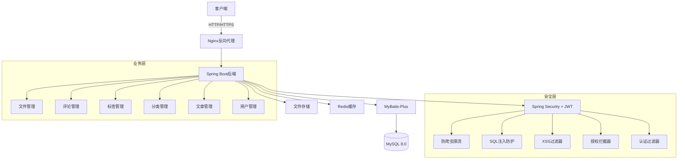
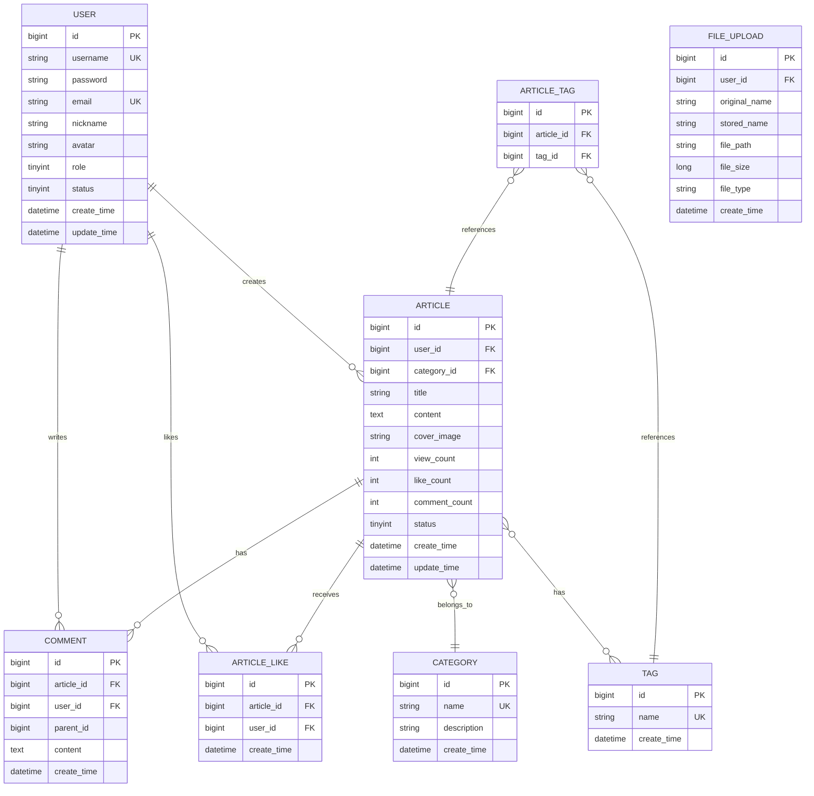

# 个人博客系统 - 项目设计文档

## 1. 系统架构



## 2. 数据库设计



## 3. 核心接口清单

### 3.1 认证接口 (AuthController)
- POST /api/auth/register - 用户注册
- POST /api/auth/login - 用户登录
- POST /api/auth/logout - 用户登出
- GET /api/auth/info - 获取当前用户信息

### 3.2 用户管理 (UserController)
- GET /api/users - 分页查询用户列表（管理员）
- GET /api/users/{id} - 获取用户详情
- PUT /api/users/{id} - 更新用户信息
- DELETE /api/users/{id} - 删除用户（管理员）
- PUT /api/users/{id}/role - 设置用户角色（管理员）
- PUT /api/users/{id}/status - 设置用户状态（管理员）

### 3.3 文章管理 (ArticleController)
- GET /api/articles - 分页查询文章列表
- GET /api/articles/{id} - 获取文章详情
- POST /api/articles - 创建文章
- PUT /api/articles/{id} - 更新文章
- DELETE /api/articles/{id} - 删除文章
- GET /api/articles/search - 搜索文章
- POST /api/articles/{id}/like - 点赞文章
- DELETE /api/articles/{id}/like - 取消点赞

### 3.4 分类管理 (CategoryController)
- GET /api/categories - 获取所有分类
- POST /api/categories - 创建分类（管理员）
- PUT /api/categories/{id} - 更新分类（管理员）
- DELETE /api/categories/{id} - 删除分类（管理员）

### 3.5 标签管理 (TagController)
- GET /api/tags - 获取所有标签
- POST /api/tags - 创建标签
- PUT /api/tags/{id} - 更新标签
- DELETE /api/tags/{id} - 删除标签

### 3.6 评论管理 (CommentController)
- GET /api/comments - 获取文章评论列表
- POST /api/comments - 发表评论
- DELETE /api/comments/{id} - 删除评论

### 3.7 文件管理 (FileController)
- POST /api/files/upload - 上传文件
- GET /api/files/download/{id} - 下载文件
- DELETE /api/files/{id} - 删除文件

## 4. 安全设计

### 4.1 认证授权
- 采用 Spring Security + JWT 实现无状态认证
- Token 有效期：2小时，支持刷新
- 密码加密：BCrypt 算法

### 4.2 权限控制
- 角色：ADMIN（管理员）、USER（普通用户）
- 基于注解的方法级权限控制：@PreAuthorize

### 4.3 安全防护
- XSS 防护：自定义 XSS 过滤器，对输入进行 HTML 转义
- SQL 注入防护：MyBatis-Plus 参数化查询
- CSRF 防护：前后端分离，使用 JWT，禁用 CSRF
- 防爬虫：基于 IP 的限流（Google Guava RateLimiter）
- 接口限流：@RateLimit 注解 + AOP

### 4.4 数据安全
- 敏感信息加密存储
- 操作日志记录（AOP）
- 全局异常处理

## 5. 技术栈

### 后端
- Java 8
- Spring Boot 2.3.12.RELEASE
- Spring Security 5.3.x
- MyBatis-Plus 3.4.3
- MySQL 8.0
- Redis 6.x
- JWT (jjwt 0.9.1)
- Lombok
- Hutool 5.7.x

### 部署
- Docker + Docker Compose
- Nginx (跨平台镜像)

## 6. 项目结构

```
backend/
├── src/main/java/com/blog/
│   ├── BlogApplication.java
│   ├── config/              # 配置类
│   ├── controller/          # 控制器
│   ├── service/             # 服务层
│   ├── mapper/              # 数据访问层
│   ├── entity/              # 实体类
│   ├── dto/                 # 数据传输对象
│   ├── vo/                  # 视图对象
│   ├── security/            # 安全相关
│   ├── filter/              # 过滤器
│   ├── interceptor/         # 拦截器
│   ├── aspect/              # 切面
│   ├── exception/           # 异常处理
│   ├── utils/               # 工具类
│   └── constant/            # 常量
├── src/main/resources/
│   ├── application.yml
│   ├── application-dev.yml
│   └── mapper/              # MyBatis XML
├── src/test/                # 测试代码
├── Dockerfile
└── pom.xml
```

## 7. 部署说明

### 环境要求
- Docker 20.10+
- Docker Compose 1.29+

### 快速启动
```bash
docker-compose up --build -d
```

### 访问地址
- 后端 API: http://localhost:8080

### 测试账号
- 管理员: admin / admin123
- 普通用户: user / admin123
